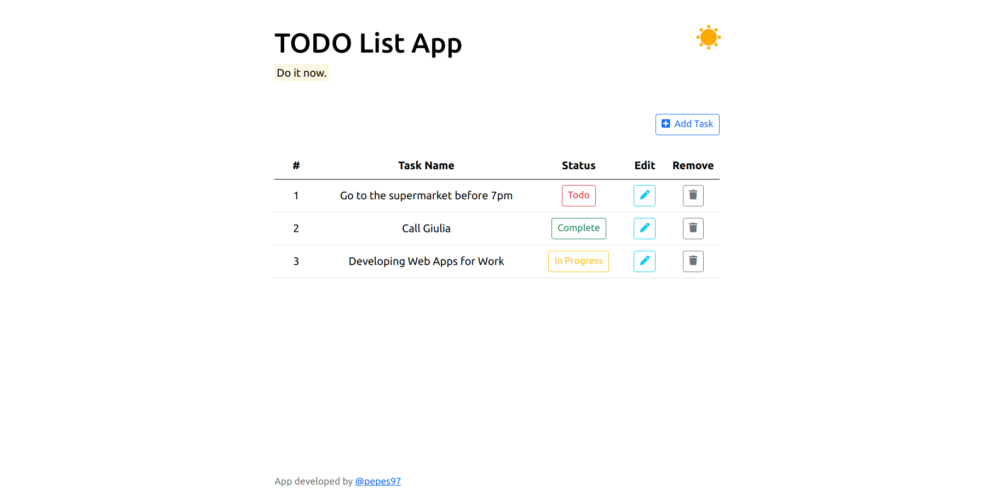
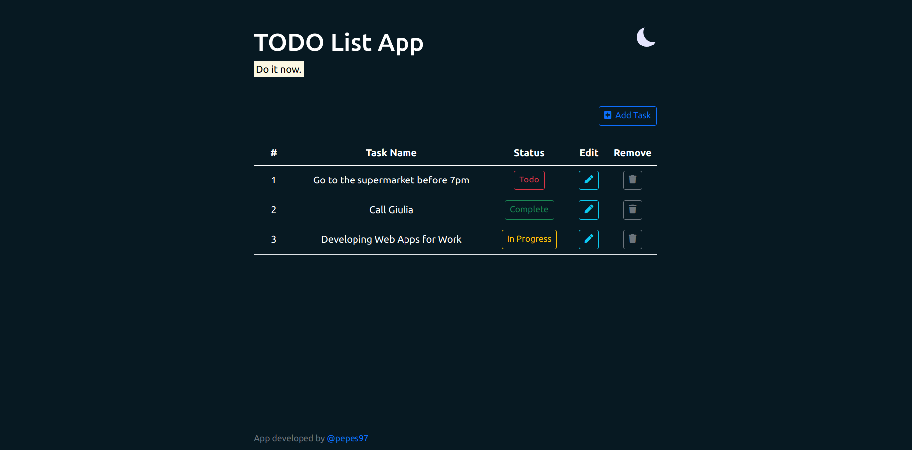

# TODO App

TODO app is an application where you can write down a to-do list.

## Enviroment Setup

* [conda](https://docs.conda.io/en/latest/)

We strongly advise utilizing the bash script setup.sh to set up the python environment for this project.
Run the following command to quickly setup the env needed to run our code: 

```
bash ./todo_setup.sh
```
It's a bash command that will setup a conda environment with everything you need. Just answer the prompts as you proceed.

## Run 

```
(todo-app) user@user-pc:~/TODO-app$ python main.py
```

## Example of the Application Dashboard

We show two different modes, day and night.

### Light mode



### Dark mode



