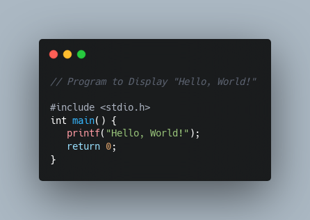

# Code to Image

A simple python utility tool to convert programming code into beautiful image snippets.

## Table of Contents

* [Environment Setup](#Environment-Setup)
    * [Windows System](#Windows-System)
    * [Linux System](#Linux-System)

* [Run](#Run)

## Enviroment Setup

1. Download this repository (you can use also git clone)

### Windows System

1. Install **Anaconda** using the following [instruction](https://docs.anaconda.com/anaconda/install/windows/#) instruction

2. Open Anaconda Prompt

3. Run the following commands

```
conda create --name code-to-img python==3.7
```

Just answer the prompts as you proceed.

4. Activate the env

```
conda activate code-to-img
```

5. Go to code-to-img folder with the prompt and run the following command

```
pip install -r requirements.txt
```

6. Download chromedriver from [this site](https://chromedriver.chromium.org/downloads) anche choose the version

7. Download the `chromedriver_win32.zip` also for Windows 64

8. Extract the folder that you have downloaded and in the `main.py` change the path of `driver_chrome` and set the path of your chomedriver execution file

### Linux System

1. Install **Anaconda** using the following [instruction](https://docs.anaconda.com/anaconda/install/linux/) instruction

2. Open Terminal

I strongly advise utilizing the bash script `setup.sh` to set up the python environment for this project.

3. Run the following command to quickly setup the env needed to run our code: 

```
bash ./todo_setup.sh
```
It's a bash command that will setup a conda environment with everything you need. Just answer the prompts as you proceed.

4. Enable env with the following command

```
conda activate todo-app
```

5. Download chromedriver from [this site](https://chromedriver.chromium.org/downloads) anche choose the version

6. Download the `chromedriver_linux64.zip` also for Linux

8. Extract the folder that you have downloaded and in the `main.py` file change the path of `driver_chrome` and set the path of your chomedriver execution file

# Run

```
python main.py --input_dir INPUT_DIR --driver_chome -- DRIVER_CHROME
```

where:

* `INPUT_DIR` is the directory code of files that you want to convert in images snippet. For instance: `app/input_code/python` means that you want to convert in images all python files that you have in that directory. Default is: `app/input_code`
* `DRIVER_CHROME` is the path of your `chromedriver` execution file

For instance:

```
python main.py --input_dir app/input_code/python --driver_chrome /home/sveva/Downloads/chromedriver_linux64/chromedriver
```

# Sample of Screenshot

|  |  |  |
| :-: | :-: | :-: | 
|  |   |   |

| |  |  |
| :-: | :-: | :-: | 
|   |  |  |

|  |  |  |
| :-: | :-: | :-: | 
|   |  |  |

|  |  |  |
| :-: | :-: | :-: | 
|   |  |  |

|  |  | 
| :-: | :-: | 
|   |  | 